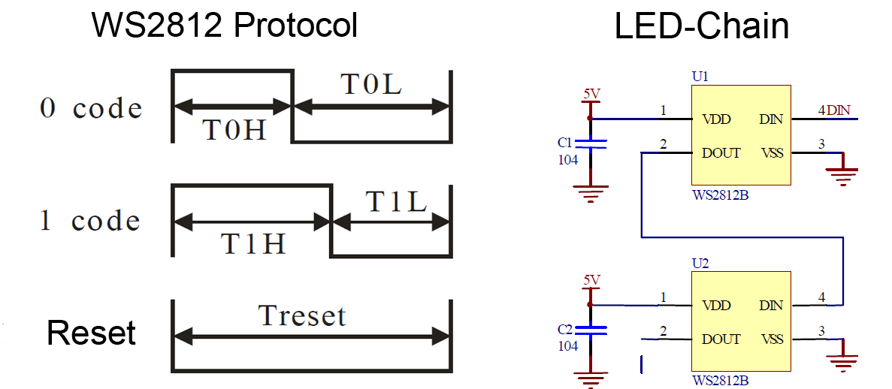
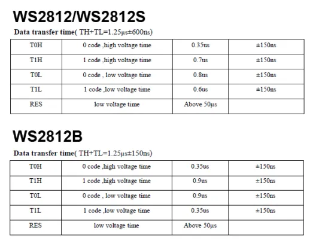

# WS2812_Interfacing on FPGA

In the last few years, programmable LED lights like the WS2812B LED have taken the illumination world by storm. These tiny modules pack separate red, green, and blue LEDs into a 5mm x 5mm, package, and they also contain a control chip so small that it's hard to see with the naked eye. This tiny chip receives an input, subtracts its own signal, and passes the remaining data to the next module in the chain. The process repeats until that single data line lights tens, hundreds, or even more than a thousand LEDs.

The data transmission protocol itself is relatively simple: a digital “1” is encoded as a long high-pulse, “0” as a short pulse on “Din”. When the data line is held low for more than 300µs, the device is reset. After reset, each device reads the first 24 bit (GRB 8:8:8) of data into an internal buffer. All consecutive bits after the first 24 are forwarded to the next device go through internal data reshaping and are then forwarded via “Dout” to the next device. The internal buffer is written to the PWM controller during the next reset.

Each separate red, green, and blue LED in a single WS2812B unit is set up to shine at 256 brightness levels, indicated by an 8-bit binary sequence set from 0 to 255. When combined, each LED unit requires three sets of eight brightness bits, or 24 bits, of information for full control. Here's a quick guide to the process:

1. A FPGA transmits this sequence of eight green bits, eight red bits, and eight blue bits to the first LED in the series.

2. When multiple LEDs are present, the data sequence that controls the second LED starts directly after the first with green, red, and blue data. The sequence continues in that pattern until it illuminates every LED present.

3. The first LED takes in information for the entire chain of LEDs, then passes the same data along without the sequence it applied to itself, transforming the second LED into the first component on the list (as far as it knows).

4. This "new number one" LED unit continues passing information along until there are no more binary LED sequences left.

## Block diagram and Data frame

The working of different modules are as follows-

1. UART_Rx - This module reads data input from the serial terminal.

2. 8-bit FIFO - This module stores data read from UART_Rx module to keep synchronization and avoid data loss.

3. WS2812_CTRL - This controller decodes the data input and stores the corresponding 24-bit RGB data into BRAM at sequential address.

4. WS2812_Interface - This module loops onto BRAM with depth specified by user at WS2812_phy module and transmits the data serially on ws data line as per the given timing details by the protocol.